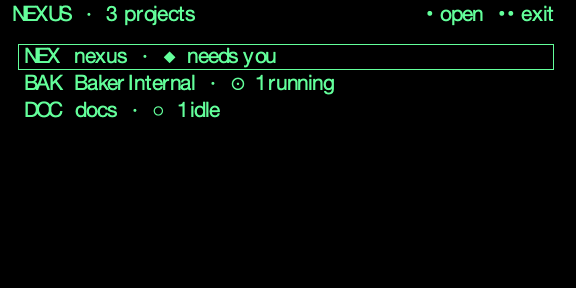

# NEXUS

A personal agent orchestration platform. NEXUS lets you define projects, break them into tasks on a Kanban board, and work those tasks interactively in chat threads powered by any model you can reach — Claude Code, Codex, OpenCode, OpenRouter, local servers, or any OpenAI-compatible endpoint. Memory persists across sessions via a local memory daemon synced to an Obsidian vault.

> NEXUS is not another bloated Agent OS. It's the control layer that makes your existing tools (Claude Code, Codex, OpenCode, OpenRouter, local models) work together the way you want.

---

## Table of Contents

- [What It Does](#what-it-does)
- [Architecture](#architecture)
- [Trust and Privacy](#trust-and-privacy)
- [Quick Start](#quick-start)
- [Server + thin clients (Tailscale)](#server--thin-clients-tailscale)
- [The Local Model Stack](#the-local-model-stack)
- [Configuration](#configuration)
- [Concepts](#concepts)
  - [Projects](#projects)
  - [Tasks & Kanban](#tasks--kanban)
  - [Models & Curation](#models--curation)
  - [Orchestrator](#orchestrator)
  - [Memory](#memory)
  - [Sessions](#sessions)
  - [Assistant](#assistant)
  - [Braindump](#braindump)
  - [Activity Console](#activity-console)
  - [Tickets (Jira mirror)](#tickets-jira-mirror)
  - [Mission Control](#mission-control)
  - [Missions](#missions)
- [Model Routing](#model-routing)
- [API Reference](#api-reference)
- [Glasses (Even G2 HUD)](#glasses-even-g2-hud)
- [Project Layout](#project-layout)
- [Development](#development)
- [Troubleshooting](#troubleshooting)

---

## What It Does

| Capability | Description |
|---|---|
| **Projects** | Link existing local git repos. NEXUS adds a `project_docs/` structure for specs, plans, and uploads. |
| **Kanban** | 5-column board (Triage → To Do → In Progress → Review → Deploy) with drag-and-drop. |
| **Interactive task chat** | Moving a task into **In Progress** opens an interactive chat thread bound to a model you pick — the old headless dispatch loop is gone. The agent works the task in the conversation while you steer it. |
| **Missions** | Bounded, recurring or self-paced autonomous jobs against a project's tasks/tickets. Hard ceilings (iterations / wall-clock / token budget / run window), a per-iteration audit ledger, and pause/resume/stop controls. Off by default; can never run unbounded. |
| **Models & curation** | A model registry (the Pi runtime) knows every model reachable from your configured auth — API keys (OpenRouter, local servers) and OAuth (Anthropic, OpenAI/Codex, GitHub Copilot). You curate which models show up in the picker; per-thread model selection with image/document attachments. No more YAML "personas". |
| **Multi-provider chat** | One runtime drives Claude Code, Codex, OpenCode, OpenRouter, local OpenAI-compatible servers (omlx, LM Studio, llama.cpp), and remote Hermes-style endpoints — each reached through the Pi SDK's provider bridges. |
| **Assistant** | A separate, project-less Hermes Assistant surface with multiple local sessions, per-session transcripts, foreground streams, and detachable background runs that can be reconciled after restart. |
| **Braindump** | Capture free-form ideas before they become tasks; triage them into a project's Kanban from the Braindump view. |
| **Activity console** | A unified operations console (running + recent) for chat turns, assistant streams, Jira/GitHub syncs, memory archive/index jobs — with abort, retry, and diagnostics per operation. |
| **Memory** | Hybrid-retrieval memory served by a standalone daemon. The Obsidian vault is canonical; a rebuildable SQLite index (sqlite-vec + FTS5 + knowledge-graph) powers recall. Agents pull it on demand via a `memory_recall` tool; exposed over HTTP + MCP. |
| **Sessions** | Per-project conversational interface with live token streaming, file drag-and-drop, structured question cards, image + PDF/document attachments, and manual archival into memory. |
| **Tickets** | A disposable mirror of Jira tickets assigned to you (Jira stays canonical). Nexus pulls them natively on a poll loop while the app is running (configured in Settings; token via `JIRA_TOKEN`), and a push endpoint stays for external sync agents. |
| **GitHub triage** | Open issues on a project's GitHub remote are mirrored into the Triage column on Kanban open (token via `GITHUB_TOKEN` or `gh auth token`); can be disabled in Settings. |
| **Notifications** | In-app toasts for events that happen while you're using Nexus — e.g. a Jira/GitHub sync that changed tickets, a sync failure, or a task summary being written. Backed by a `notifications` table the frontend polls. |
| **Mission Control** | The landing dashboard: memory-daemon health, your curated model list with per-provider auth health, and usage stats (Claude/Codex/OpenRouter session windows). |
| **Trust & Privacy** | A read-only trust snapshot surfaced in Settings — services, storage, secret sources, outbound destinations, and maintenance controls (rebuild index, clear Nexus memory). |
| **Settings** | In-app editor for `~/.nexus/config.yaml` — API keys, models, memory budget, Jira + GitHub sync, signal filters. |

---

## Architecture

```
┌─────────────────────────────────────────────────────────┐
│                    Tauri (Rust core)                    │
│  ┌────────────────────────────────────────────────────┐ │
│  │               React Dashboard (Vite)                │ │
│  │  Mission Control | Kanban | Sessions | Tickets |    │ │
│  │  Braindump | Assistant | Activity | Memory |Usage   │ │
│  └─────────────────────────────┬──────────────────────┘ │
│                        │ HTTP (localhost:4173)           │
│  ┌─────────────────────▼──────────────────────────────┐ │
│  │               Node.js Backend (Fastify)             │ │
│  │                                                      │ │
│  │   Routes ── Pi Runtime ── Jira Poll ── MemClient    │ │
│  │              (ModelRegistry + AuthStorage)          │ │
│  └──┬───────────┬──────────────┬──────────────┬───────┘ │
│     │           │              │              │          │
│  SQLite      Pi sessions    Memory client   HTTP models   │
│ (nexus.db)  (per-thread,    → daemon        (OpenAI-compat)│
│              SDK-driven)      (HTTP :4100)                │
│                              │                            │
│                              ▼                            │
│                          ┌──────────────────────────┐    │
│                          │  @nexus/memory-daemon     │    │
│                          │  Obsidian vault + index   │    │
│                          │  + 3 local llama servers  │    │
│                          │  gen 4001/embed 4002/     │    │
│                          │  rerank 4003              │    │
│                          └──────────────────────────┘    │
└─────────────────────────────────────────────────────────┘
```

The backend runs the Fastify HTTP API, the Jira polling loop, and the mission scheduler loop in a single Node process. **Model execution is driven by the [Pi runtime](https://github.com/earendil-works/pi-coding-agent)** (`@earendil-works/pi-coding-agent`): one `PiRuntime` per backend owns an `AuthStorage` (credentials in `~/.nexus/auth.json`) and a `ModelRegistry` (every model reachable from that auth), and creates one `AgentSession` per chat thread. The old headless orchestrator dispatch loop has been removed — task work now happens interactively in chat threads. **Memory is a separate concern**: a standalone `@nexus/memory-daemon` (its own process, port 4100) owns the canonical Obsidian vault, its file watcher, and the rebuildable SQLite index — the Nexus backend talks to it over HTTP (and external CLI agents reach it over MCP). The daemon in turn calls a **local model stack of three independent llama-server processes** (generation 4001, embeddings 4002, reranking 4003). Nexus's own `nexus.db` holds projects/tasks/sessions/tickets/missions; memory lives in the daemon's index, not `nexus.db`. The frontend is a React SPA served by Vite in dev and bundled into the Tauri app for production. The desktop shell is **Tauri v2** (a small Rust core using the OS WebView) — it supervises the daemon/backend services and hosts the UI; it replaced the previous Electron shell (~15× smaller, ~177 MB less idle RAM).

### Packages

| Path | Package | Role |
|---|---|---|
| `src/shared` | `@nexus/shared` | Shared TypeScript types and constants |
| `src/backend` | `@nexus/backend` | Fastify API, orchestrator, Jira polling |
| `src/memory-daemon` | `@nexus/memory-daemon` | Standalone memory daemon (vault + index + retrieval), HTTP :4100 + MCP |
| `src/frontend` | `@nexus/frontend` | React dashboard |
| `tauri` | `nexus-tauri` | Tauri v2 (Rust) desktop shell — supervises the services + loads the UI |

---

## Trust and Privacy

Nexus has no application analytics or telemetry integration. Its backend and memory daemon listen on loopback by default, and the packaged app bundles the frontend rather than exposing a frontend server. In development, Vite also listens on port `5173`. Configured model, assistant, Jira, and GitHub providers still receive the requests required to perform their service; their own privacy and telemetry policies apply.

### Local services and storage

| Component or data | Default location | Boundary |
|---|---|---|
| Backend API | `127.0.0.1:4173` | Local Fastify service; owns application workflows and `nexus.db` |
| Memory daemon | `127.0.0.1:4100` | Local vault/index owner; backend and MCP clients call it over HTTP |
| Frontend dev server | `127.0.0.1:5173` | Development only; production assets are bundled into the Tauri app |
| Local generation / embedding / reranking | `127.0.0.1:4001` / `:4002` / `:4003` | Optional local model services used by memory retrieval/indexing |
| Projects, tasks, hot sessions, mirrored tickets | `~/.nexus/nexus.db` | Local application state |
| Memories and archived-session summaries | configured Obsidian vault (default `~/Obsidian/Nexus/`) | Canonical Markdown |
| Memory search, vectors, and knowledge graph | `<vault>/.index/nexus-memory.db` | Disposable index, rebuildable from canonical Markdown |
| Nexus configuration | `~/.nexus/config.yaml` | Non-secret settings, environment references, and any literal model/assistant keys entered in Settings |
| Pi provider API keys and OAuth credentials | `~/.nexus/auth.json` | Local credential file managed by the Pi runtime |

Ports and paths can be changed in configuration. **Settings → Trust & Privacy** shows the effective trust-relevant values and credential sources without returning raw secrets to the browser.

### Secrets

- Provider API keys (OpenRouter, local-model, assistant) and OAuth credentials (Anthropic, OpenAI/Codex, GitHub Copilot) are stored in `~/.nexus/auth.json`, managed by the Pi runtime's `AuthStorage`.
- OpenRouter, local-model, and assistant keys also support `${ENV_VAR}` interpolation in `config.yaml`. If a literal key is entered in Settings, it is stored in `config.yaml` and masked when Settings reads it back.
- `JIRA_TOKEN` is read from the process environment. Nexus also loads the nearest local `.env` file at startup without overwriting variables already exported by the shell.
- GitHub issue sync prefers `GITHUB_TOKEN`, then falls back to `gh auth token`; the GitHub CLI owns the fallback credential storage.

### What leaves the machine

| Destination | Data sent when enabled or used |
|---|---|
| Configured model providers (via Pi runtime) | Prompts, conversation context, selected attachments/images, tool results, and any recalled memory injected into the prompt |
| Configured assistant endpoint | Assistant conversation messages and the configured bearer credential |
| Jira Cloud | The configured account email, API token, project/search query, and issue requests |
| GitHub | Repository owner/name, issue API requests, and a token when one is available |

Model and memory-model calls remain on the machine only when their configured endpoints are loopback addresses; remote configured endpoints receive the request data listed above. Nexus does not send the Obsidian vault or `nexus.db` wholesale; only content needed for the specific provider request is included.

### Memory boundaries and controls

Memory uses namespaces: `nexus` for Nexus project memory, `global` for shared memory, and separate namespaces for external agents. Auto-injection can be disabled or limited in Settings; when enabled, relevant memories are added to provider prompts up to the configured count and token budget.

Session archival is manual. A successful archive summarizes the session into canonical `nexus` memory and only then removes the hot thread from `nexus.db`; a failed memory write leaves the thread intact.

Settings provides two maintenance controls:

- **Rebuild index** re-scans canonical Markdown and regenerates disposable retrieval state without deleting vault files.
- **Clear Nexus memory** permanently deletes canonical files in the `nexus` namespace after the exact confirmation phrase `CLEAR NEXUS MEMORY`. It preserves `global`, external-agent namespaces, and unrelated vault files.

---

## Quick Start

### Prerequisites

- **Node.js** ≥ 20
- **Rust** (stable) + **Xcode Command Line Tools** — to build the Tauri desktop shell on macOS. The WebView is the OS-provided WebKit (nothing extra to install). `xcode-select --install`; install Rust via [rustup](https://rustup.rs) or `brew install rust`.
- **At least one model provider credential** — pick whichever you want to use:
  - **OpenRouter API key** — the easiest way to reach hundreds of models from one key ([get one](https://openrouter.ai/keys)).
  - **Anthropic / OpenAI / GitHub Copilot OAuth** — sign in via Settings → Auth; the Pi runtime stores the token in `~/.nexus/auth.json`.
  - **Claude Code CLI** (`claude`), **Codex CLI** (`codex`), or **OpenCode CLI** (`opencode`) — installed and on your `PATH` if you want to use their provider bridges ([Claude Code install](https://docs.claude.com/claude-code)).
  - **A local OpenAI-compatible server** (omlx, LM Studio, llama.cpp, …) — point `models.local.base_url` at it.
- **A local model stack** (optional, for memory + local chat) — three OpenAI-compatible endpoints for generation, embeddings, and reranking. See [The Local Model Stack](#the-local-model-stack) — the launch flags matter.

### Install

```bash
cd nexus
npm install
# install per-package deps
(cd src/backend && npm install)
(cd src/frontend && npm install)
(cd src/memory-daemon && npm install --no-workspaces)
```

### Set your API keys

For local development, copy `.env.example` to `.env` and fill in the values you use:

```bash
cp .env.example .env
```

The backend loads `.env` on startup. Already-exported shell variables take precedence.

```bash
export OPENROUTER_API_KEY="sk-or-..."   # OpenRouter models + chat
export OMLX_API_KEY="..."               # local model server, if it requires auth
export ASSISTANT_API_KEY="..."          # the standalone Assistant view endpoint
export HERMES_API_KEY="..."             # remote Hermes-style endpoint (if used)
```

GitHub issue sync: run `gh auth login` before starting, or set `GITHUB_TOKEN`.

### Run in dev (one command)

```bash
npm run web
```

Boots all three services — memory daemon (`:4100`), backend (`:4173`), frontend (`:5173`) —
concurrently (color-prefixed per service), waits until the frontend **and** backend health are up,
then opens your browser to http://localhost:5173.

- **Stop:** `Ctrl-C` in the terminal stops all three cleanly (ports freed, no orphaned processes).
- **Closing the browser does _not_ stop the services** — the script isn't tied to the browser tab,
  so the servers keep running until you `Ctrl-C`. (This differs from the desktop app, where closing
  the window tears the services down.)
- The local llama stack (4001/4002/4003) is **not** managed by this script — start it separately (see below).

### Run in dev (manual, three terminals)

```bash
# Terminal 1 — memory daemon (vault + index + retrieval, HTTP :4100).
# Required for memory features; the backend degrades gracefully if it's down.
npm run dev:daemon          # or: cd src/memory-daemon && npm start

# Terminal 2 — backend (Fastify on :4173, orchestrator, Jira polling)
npm run dev:backend         # or: cd src/backend && npm run dev   (tsx watch, live reload)

# Terminal 3 — frontend (Vite on :5173)
npm run dev:frontend        # or: cd src/frontend && npm run dev
```

Open http://localhost:5173

### Run the desktop app (Tauri)

The desktop app is **self-contained**: a Rust supervisor brings up the required services itself
behind a startup splash that shows each service's status, then opens the main UI. It probes each
port first and **reuses** anything already running (e.g. a daemon under LaunchD), so it won't
double-spawn. If the local model stack (`4001/4002/4003`) isn't reachable, it shows a non-blocking
warning and continues in degraded (FTS-only) mode. Closing the window stops the services it started.

```bash
npm run dev    # = tauri:dev — launches the Tauri shell with Vite HMR; the supervisor
               # spawns the daemon, backend, and Vite dev server (or reuses any already up)
```

The first `tauri:dev` compiles the Rust core (a few minutes); later runs are fast. For a compiled
production build of just the services + frontend (without the shell), `npm run build`.

> **Native ABI note.** The backend/daemon run as standalone Node processes — under the developer's
> **system Node** in dev and a **bundled Node** in the packaged app — spawned via
> `std::process::Command`, never a `fork()`. `better-sqlite3` must match the ABI of whichever Node
> runs it. In dev, `scripts/ensure-sqlite-abi.cjs` runs as a `predev`/`prestart` hook for the backend
> and the daemon (two separate installs): it verifies the native module loads under the current Node
> and, if not, rebuilds the owning install before the process starts. In the packaged app, the staged
> services' native modules are built against the bundled Node by `scripts/stage-services.cjs`, so the
> ABI matches. Ensure a system `node` (≥ 20) is on your `PATH` for dev.

### Build a distributable (signed + notarized `.dmg`, macOS)

`npm run dist` runs the whole pipeline (`scripts/dist-macos.sh`): build → sign → sign the bundled
Node + native modules → notarize + staple the app → build the DMG → notarize + staple it → verify
Gatekeeper. Output: `tauri/src-tauri/target/release/bundle/dmg/Nexus.dmg`.

**One-time setup, per machine** (nothing sensitive is stored in the repo):

```bash
# 1. A "Developer ID Application" certificate in your login keychain
#    (Xcode → Settings → Accounts → Manage Certificates → + → Developer ID Application).
security find-identity -v -p codesigning | grep "Developer ID Application"

# 2. A notarytool credential profile named "nexus-notary" (App Store Connect API key shown;
#    or use --apple-id / --team-id / --password with an app-specific password):
xcrun notarytool store-credentials "nexus-notary" \
  --key /path/AuthKey_XXXX.p8 --key-id <KEY_ID> --issuer <ISSUER_UUID>
```

**Set the signing identity in your environment** (e.g. add to `~/.zshrc`), then build:

```bash
export APPLE_SIGNING_IDENTITY="Developer ID Application: Your Name (TEAMID)"
# NEXUS_NOTARY_PROFILE defaults to "nexus-notary" — only set it if you named the profile differently.
npm run dist
```

For a quick **unsigned local** app bundle (no signing/notarization), run `npm run tauri:build`
instead — it produces `Nexus.app` under `tauri/src-tauri/target/release/bundle/macos/`.

> Scope: macOS arm64 only, Developer ID distribution, no auto-update — see
> `project_docs/specs/2026-06-09-pure-pi-architecture-design.md`.

On first run, NEXUS creates `~/.nexus/` with default config, an Obsidian vault,
the SQLite database, and the directory for Pi session logs. (There are no longer
any "starter personas" or a seeded `providers` table — model reachability is
discovered at runtime from your auth; see [Models & Curation](#models--curation).)

---

## Server + thin clients (Tailscale)

Run the full stack on **one machine** (the *server* — the single source of truth for sessions,
threads, and memory) and connect from other machines or the glasses as **thin clients** over a
[Tailscale](https://tailscale.com/) tailnet, so a session started on one device can be picked up on
another. Client mode is chosen **at boot**: when `server.url` resolves to a remote (non-loopback)
host, the desktop shell **spawns nothing locally** and points its UI at the remote backend; a
loopback/empty `server.url` runs the full stack as usual.

### On the server

The server needs the **backend** (`:4173`) and the **memory daemon** (`:4100`). It does **not** need
the main frontend (`src/frontend`) built or served — each client bundles its own UI and only calls
the backend's `/api`. (The *glasses* cockpit is a separate build, `src/glasses/dist`, served by the
gateway; build it only if you use the glasses.)

```bash
npm run build                     # builds @nexus/shared + backend (frontend is built too but unused here)
node src/backend/dist/index.js    # run the backend headless — or `npm run dev:backend` (tsx watch) for dev
# the memory daemon typically runs under LaunchD (see The Local Model Stack); start it if it isn't up
```

Expose the backend to the tailnet with `tailscale serve`. The backend **stays bound to loopback** —
Tailscale terminates TLS and proxies in, so there's no bind change and access is tailnet-only
(ACL-gated):

```bash
tailscale serve --bg --https=8444 127.0.0.1:4173   # backend -> https://<host>.ts.net:8444
tailscale serve --bg --https=8900 127.0.0.1:8899   # (optional) glasses gateway -> https://<host>.ts.net:8900
tailscale serve status                             # confirm the mappings
```

### Authentication (one shared token)

Set `server.token` to gate `/api/*` (everything except `/api/health`) with a bearer — generate one
with `openssl rand -hex 16`. On the server, provide it via the `NEXUS_BACKEND_TOKEN` env var (the
default `token: "${NEXUS_BACKEND_TOKEN}"` expands it) or as a literal in `config.yaml`. The **glasses
gateway inherits this token** when `gateway.token` is unset, so a single secret guards both.

> **Set the token _before_ exposing the port.** With no token the backend is open to your whole
> tailnet — acceptable only if you trust every device on it.

### On a client (another Mac / the glasses)

Build and run the desktop app, then point it at the server in `~/.nexus/config.yaml` (or in-app via
**Settings → Connection (this device)**):

```yaml
server:
  url: https://<host>.ts.net:8444    # the server's tailscale-serve URL (MagicDNS name)
  token: <the-same-token>            # literal — the launcher does not expand ${ENV}
```

> Prefer **unquoted** values here — these two are read by the desktop launcher (a light
> line-scanner, not a full YAML parser). Surrounding quotes are tolerated, but plain is cleanest.

Restart the app; it boots as a thin client (no local backend/daemon/models, UI pointed at the
server). The **glasses** point at the gateway URL with the token as a query param
(`https://<host>.ts.net:8900/?token=<token>`), since their event stream can't send an
`Authorization` header.

### Where the work runs

**Everything runs on the server.** Agent sessions execute inside the backend process, so when a model
edits a file, runs a command, or makes a git commit, it happens on **the server's filesystem** — in
the project's `repo_path`, a directory *on the server*. Clients (a laptop, the glasses) are thin
remote controls: they send prompts and stream back diffs/output, but never touch files themselves.

Consequences worth internalizing:

- **Projects are the server's repos.** A project's `repo_path` must exist on the server — clone the
  repo there. You *steer* from a client, but the *work* lands on the server.
- **Git happens on the server.** Commits/branches are made in the server's checkout; sync them to a
  client the normal way (push from the server → `git pull` on the client).
- **The agent uses the server's environment** — its installed CLIs (`gh`, `claude`, `codex`, `git`),
  its `PATH`, and its credentials. A session that needs a particular tool or login needs it on the
  *server*, not the client.
- You **can't** point a session at a repo that exists only on a client — the agent only sees the
  server's disk. Put the repo on the server, or run a full-stack Nexus locally (empty `server.url`)
  for that project.

### Verify

```bash
curl https://<host>.ts.net:8444/api/health                                       # 200 (public)
curl https://<host>.ts.net:8444/api/projects                                     # 401 (no token)
curl -H "Authorization: Bearer <token>" https://<host>.ts.net:8444/api/projects  # 200
```

**Limitations.** A thin client needs the tailnet reachable — there's no offline mode (use the glasses
when out). Two clients can't watch the *same in-flight* turn's token stream (the run continues
server-side but isn't re-broadcast); resume-after and next-turn work fine.

---

## The Local Model Stack

Memory retrieval (and local chat) rely on **three independent OpenAI-compatible servers** on
loopback. The reference setup runs three `llama-server` (llama.cpp) processes — **and the launch flags
are not optional**. A server can be listening on its port but still reject every request if it wasn't
started in the right mode. (Nexus currently reports such failures as "unreachable" even when the
server is up — see Troubleshooting.)

| Port | Role | Recommended model | Required mode flags |
|---|---|---|---|
| 4001 | generation (HyDE + KG extraction + session archive summaries) | a small instruct model, e.g. `Qwen3-*-Instruct` (Q4_K_M) | `--ctx-size 32768`; `--reasoning off` **if the model is a reasoning/"thinking" model** — otherwise it spends its whole token budget thinking and returns empty content |
| 4002 | embeddings | `nomic-embed-text-v1.5` (f16, 768-dim) | `--embedding --pooling mean` |
| 4003 | reranking | `qwen3-reranker-0.6b` (q8_0) | `--reranking` |

`--reasoning off` (alias `-rea off`) requires a recent llama.cpp build; on older builds use
`--reasoning-budget 0`. It only fully suppresses thinking on *hybrid* models (Qwen3, etc.); for
always-on reasoning models (e.g. DeepSeek-R1) pick a non-reasoning gen model instead.

Full launch commands (shared flags: `--host 127.0.0.1 --n-gpu-layers 99 --flash-attn on`):

```bash
# 4001 — generation (HyDE + knowledge-graph extraction)
llama-server --model ~/Models/Qwen3-Instruct-Q4_K_M.gguf \
  --port 4001 --host 127.0.0.1 --n-gpu-layers 99 --ctx-size 32768 --flash-attn on \
  --reasoning off

# 4002 — embeddings (768-dim vectors for vector recall)
llama-server --model ~/Models/nomic-embed-text-v1.5.f16.gguf \
  --port 4002 --host 127.0.0.1 --n-gpu-layers 99 --ctx-size 8192 --flash-attn on \
  --embedding --pooling mean --ubatch-size 1024

# 4003 — reranking (cross-encoder reorder of recall candidates)
llama-server --model ~/Models/qwen3-reranker-0.6b-q8_0.gguf \
  --port 4003 --host 127.0.0.1 --n-gpu-layers 99 --ctx-size 8192 --flash-attn on \
  --reranking
```

The gen model also summarizes archived sessions, so use a `32768` context window where VRAM allows it.
Smaller contexts can work for memory retrieval but may reject longer archive prompts. Sanity-check each
server after launch:

```bash
curl -s -X POST http://127.0.0.1:4002/v1/embeddings \
  -d '{"model":"nomic-embed-text-v1.5","input":"hello"}' | head -c 80   # expect a 768-float vector
curl -s -X POST http://127.0.0.1:4003/v1/rerank \
  -d '{"model":"qwen3-reranker-0.6b","query":"q","documents":["a","b"]}' | head -c 80   # expect results[]
```

If you'd rather run a single OpenAI-compatible server (omlx, LM Studio, …) for everything, point the
`memory.models.*_url` values at it — but it must genuinely implement `/v1/embeddings` and `/v1/rerank`,
not just `/v1/chat/completions`. Without a working embeddings + rerank endpoint, recall falls back to
FTS-only and `deep_index` jobs dead-letter.

### Example: consolidated single-box setup (32 GB Apple Silicon)

On a memory-constrained host (e.g. a 32 GB M1 Pro) you can't keep a big model resident **and** the
embed+rerank pair **and** leave room for a large context — the weights alone crowd the Metal
`iogpu.wired_limit` (~21–22 GB by default on 32 GB). The move is to run **one small, non-vision
instruct model** that serves both the Nexus local chat *and* the daemon's HyDE/KG gen calls, and to
let vision live on a *client* (a laptop with an mmproj model) rather than on the server. Small is the
right call anyway: the gen role only ever uses short contexts; agentic/cron jobs that gather info need
the internet (route those to a cloud model when online); and the leftover RAM lets the coding context
go large. Embeddings and reranking stay separate (they need `--embedding` / `--reranking` mode — a
chat server can't also serve those).

This is the setup on `baker-pro` (the Tailscale server host). The whole model stack stays in the 4000s
(`:4001` gen/chat, `:4002` embed, `:4003` rerank):

| Port | Serves | Model | Resident |
|---|---|---|---|
| 4001 | Nexus local chat (`models.local`) **+** daemon gen (`memory.models.gen_url`) — HyDE, KG extraction, archive summaries, offline coding | `Qwen3.5-9B` Q4_K_M | ~5.3 GB + KV |
| 4002 | embeddings | `nomic-embed-text-v1.5` f16 | ~0.3 GB |
| 4003 | reranking | `qwen3-reranker-0.6b` q8_0 | ~0.6 GB |

Qwen3.5-9B is a hybrid-thinking model, so the gen role **must** run `--reasoning off` (alias
`-rea off`) — otherwise it spends its budget thinking and KG extraction returns empty. `--parallel 1`
gives one slot the full context (instead of the default 4-way split, which would quarter it). Size the
context to the gen role's real need — `--ctx-size 32768` comfortably covers HyDE/KG and archive
summaries. The weights are small enough that you *could* go much larger (even 128 K ≈ ~18 GB total,
under a 24 GB wired limit) if you also drove local coding through it, but reserving that KV is wasteful
for a memory-focused model.

```bash
# 4001 — daily runner: local chat + memory gen (no vision)
llama-server --model ~/models/Qwen3.5-9B-Q4_K_M.gguf --alias Qwen3.5-9B-Q4_K_M \
  --port 4001 --n-gpu-layers 99 --parallel 1 --ctx-size 32768 \
  --flash-attn on --cache-type-k q8_0 --cache-type-v q8_0 --reasoning off \
  --temp 0.3 --top-p 0.8 --top-k 20 --min-p 0.0 --jinja

# 4002 — embeddings   (--embedding --pooling mean, ubatch 1024 so long chunks don't 501)
# 4003 — reranking    (--reranking)
#   ...as in the reference commands above.
```

Wire both consumers to `:4001` in `~/.nexus/config.yaml`:

```yaml
models:
  local:
    base_url: "http://127.0.0.1:4001/v1"
    chat_model: "Qwen3.5-9B-Q4_K_M"
    supports_images: false               # no mmproj here — vision lives on a client
memory:
  models:
    gen_url: "http://127.0.0.1:4001/v1"  # daily runner sits on the daemon's default gen port; whole stack stays in the 4000s
    embed_url: "http://127.0.0.1:4002/v1"
    rerank_url: "http://127.0.0.1:4003/v1"
```

**Keep the stack alive across reboots/crashes.** A bare `nohup` gets reaped when its launching session
ends — supervise each `llama-server` with a user LaunchAgent instead, so it auto-restarts (same pattern
as the Nexus backend/daemon). One plist per service, each `ProgramArguments` = `/opt/homebrew/bin/llama-server`
+ that service's flags (include `--alias <name>` so the model id matches `models.local.chat_model`),
with `RunAtLoad` and `KeepAlive` both true. **Check for agents that already exist first**
(`launchctl list | grep -i llama`) — a host may already supervise these under its own labels, and a
second set racing for the same ports on boot is a nasty, non-deterministic failure:

| Service | Label (this host) | Port |
|---|---|---|
| gen/chat model | `com.k-sym.llama-qwen9b` | 4001 |
| embedder | `com.k-sym.llama-embed` | 4002 |
| reranker | `com.k-sym.llama-reranker` | 4003 |

```bash
launchctl bootstrap gui/$(id -u) ~/Library/LaunchAgents/com.k-sym.llama-qwen9b.plist   # load + start
launchctl kickstart -k gui/$(id -u)/com.k-sym.llama-qwen9b                              # restart in place
launchctl bootout   gui/$(id -u)/com.k-sym.llama-qwen9b                                 # stop + unload
# to apply a plist *edit*: bootout, then bootstrap again — but not back-to-back
# (a too-fast bootout→bootstrap races and fails with "5: Input/output error"; retry once).
```

Once these own `:400x`, don't also start the models in Barn (port clash) — Barn's `models.json` is then
just a fallback reference. Raise the Metal wired limit for headroom and persist it with a boot-time
`LaunchDaemon` running `sysctl iogpu.wired_limit_mb=24576`. After changing `config.yaml`, restart the
memory daemon and
backend so they re-read it.

---

## Configuration

All config lives under `~/.nexus/`:

```
~/.nexus/
├── config.yaml            # Global settings (non-secret)
├── auth.json              # Pi runtime credentials: API keys + OAuth tokens (mode 0600)
├── model-curation.json    # Which models you've enabled in the picker (mode 0600)
├── sessions/              # Pi session JSONL logs, per-repo subdirs
│   └── <repo-slug>/<threadId>.jsonl
├── workspaces/            # Per-project agent output logs (legacy)
│   └── <project-slug>/outputs/<task-id>.log
├── nexus.db               # SQLite database (projects/tasks/threads/tickets/missions)
└── logs/                  # Application logs
```

The Obsidian vault (canonical memory + chat archives) defaults to `~/Obsidian/Nexus/` so it's visible
to Obsidian's vault picker. The daemon's rebuildable memory index lives **inside the vault** at
`<vault>/.index/nexus-memory.db` (default `~/Obsidian/Nexus/.index/`), not under `~/.nexus/`.

### `config.yaml`

```yaml
server:
  port: 4173                           # local port the backend binds (loopback only)
  url: ""                              # thin-client: point THIS device at a remote Nexus backend
                                       #   (e.g. a Tailscale host, incl. its TLS port). Empty or a
                                       #   loopback URL => run the full stack locally. See
                                       #   "Server + thin clients (Tailscale)".
  token: "${NEXUS_BACKEND_TOKEN}"      # bearer guarding /api/* (except /api/health) once the backend
                                       #   is exposed beyond loopback; empty => open (loopback dev).
                                       #   The glasses gateway inherits this when gateway.token is
                                       #   unset, so one token guards both. Literal on clients (the
                                       #   desktop launcher does not expand ${ENV}).

models:
  openrouter:
    api_key: "${OPENROUTER_API_KEY}"   # env var interpolation
  local:                               # "Custom Model Endpoint" in Settings: any OpenAI-compatible
                                       #   chat server. `local` is just the provider id — the host can
                                       #   be this machine or another box on the network/tailnet.
    base_url: "http://127.0.0.1:4001/v1"
    api_key: "${OMLX_API_KEY}"         # if your server requires auth; env interpolation supported
    supports_images: false             # true when the chat endpoint has vision support (e.g. mmproj loaded)
    embedding_model: ""                # optional overrides for the memory stack
    rerank_model: ""

assistant:                             # the standalone Assistant view (project-less chat)
  url: ""                              # any OpenAI-compatible chat completions URL
  api_key: "${ASSISTANT_API_KEY}"

# Signal filters trim noisy tool output before it lands in chat history
# (ANSI, progress bars, repeated lines, package-manager spam, test output,
# stack traces, diff context). See src/backend/signal-filters/.
signal_filters:
  enabled: true
  min_input_bytes: 4096
  max_output_bytes: 12000
  filters:
    ansi: true
    progress: true
    repeated_lines: true
    package_manager: true
    test_output: true
    stack_trace: true
    diff_context: true
  projects: {}                         # per-project overrides keyed by slug

# Memory is served by the standalone @nexus/memory-daemon (separate process, see
# src/memory-daemon/). The Obsidian vault is canonical; the SQLite index is rebuildable.
# This `memory:` block is shared: the Nexus backend reads `daemon_url`; the daemon
# reads `port`/`vault_path`/`models`/`retrieval` (all optional — it defaults them, so
# a minimal config only needs daemon_url).
memory:
  daemon_url: "http://127.0.0.1:4100"  # Nexus backend -> daemon (HTTP)
  # --- daemon's own settings (optional; defaults shown) ---
  port: 4100
  vault_path: "~/Obsidian/Nexus"       # canonical markdown vault
  models:                              # local llama stack, loopback only (see "The Local Model Stack")
    gen_url:    "http://127.0.0.1:4001/v1"   # HyDE + KG triple extraction
    embed_url:  "http://127.0.0.1:4002/v1"   # nomic-embed-text-v1.5 (768-dim)
    rerank_url: "http://127.0.0.1:4003/v1"   # qwen3-reranker-0.6b
  retrieval:
    hyde: true
    sentence_threshold: 0.05   # cross-encoder noise floor for sentence trimming
    token_budget: 1500         # cap on assembled recall context

jira:                            # native Jira ticket poll (Settings -> Jira). Token via JIRA_TOKEN env.
  enabled: false                 # off by default; poll runs only while the backend is up
  user: ""                       # Atlassian account email that owns the token
  instance: ""                   # e.g. your-company.atlassian.net (https:// optional)
  project: "SUP"                 # project key to sync
  poll_minutes: 15               # cadence while Nexus is running
  content_rules: []              # optional content rules

github:                          # GitHub issue triage (Settings -> GitHub). Token via GITHUB_TOKEN or `gh auth token`.
  enabled: true                  # mirrors open issues into Triage on Kanban open

obsidian:                        # where the canonical vault lives
  vault_path: "~/Obsidian/Nexus"
  sync_interval_seconds: 30
```

Environment variables are interpolated with `${VAR}` syntax, and Nexus loads the nearest local `.env` file without replacing already-exported values. Environment references are preferred for OpenRouter, local-model, and assistant keys; literal values entered in Settings are stored in `config.yaml` and masked on read. Provider API keys and OAuth tokens live in `~/.nexus/auth.json` (managed by the Pi runtime, never in `config.yaml`). Jira uses `JIRA_TOKEN`; GitHub uses `GITHUB_TOKEN` or `gh auth token`.

---

## Concepts

### Projects

A project links to an **existing local directory** (typically under `~/Projects/`). NEXUS does not clone repos — you point it at a repo you already have. On registration it creates:

```
<your-repo>/project_docs/
├── specs/      # specifications, tech specs
├── plans/      # project plans, roadmaps
└── uploads/    # files dragged into chat for agent review
```

### Tasks & Kanban

Tasks flow through five columns:

```
Triage → To Do → In Progress → Review → Deploy
```

There is no "Done" column — once a task reaches **Deploy** it's considered complete. Each task has a title, description, priority (low/medium/high/urgent), optional assigned agent, and tags.

Moving a task into **In Progress** triggers the orchestrator.

### Models & Curation

NEXUS no longer ships a "personas" abstraction. Instead, the **Pi runtime** (`@earendil-works/pi-coding-agent`) is the single source of truth for what models are available and how to reach them.

- **`AuthStorage`** (`~/.nexus/auth.json`) holds credentials: API keys (OpenRouter, local servers, the Assistant endpoint) and OAuth tokens (Anthropic, OpenAI/Codex, GitHub Copilot). Add them in **Settings → Auth** — either paste an API key or kick off an OAuth flow (the UI polls the flow and accepts a manual callback when a provider requires it).
- **`ModelRegistry`** enumerates every model reachable from your configured auth, per provider. Each model carries its `provider`, `id`, display `name`, whether it reasons, its context window, max output tokens, and input modalities (`text`/`image`).
- **Curation** (`~/.nexus/model-curation.json`) is the user's filter over the registry. Out of the box every auth-configured model is shown; once you enable/disable models in **Settings → Models**, only your curated set appears in the chat model picker, the task model picker, and Mission Control. Curation is keyed by `provider/id` and degrades gracefully — if a model disappears from the registry (e.g. an OAuth token is revoked), it silently drops out of the curated list.
- **Per-thread model selection**: each chat turn picks a `modelKey` (`provider/id`). The chosen model is persisted on the thread (`last_model_key`) and on a task (`model_key`) so reopening either restores it. Switch models mid-conversation at any time.

> The legacy `personas` and `providers` SQLite tables are retained in `db.ts` for one more release as back-compat shims and are not surfaced in the UI or API. There is no `/api/personas` or `/api/providers` route.

### Orchestrator

There is no longer a headless dispatch loop. The orchestrator module was removed when task work moved into interactive chat threads (the backend's `index.ts` notes: *"the old headless orchestrator dispatch loop has been removed"*).

What remains is the **task → chat** flow:

1. A task sits in **Triage** or **To Do** with no thread attached.
2. You drag it into **In Progress**. If it has no chat thread yet, the **model picker** opens (`TaskModelPicker`) — pick any model from your curated set.
3. NEXUS creates a chat thread titled after the task, links it (`tasks.thread_id` + `tasks.model_key`), flips the card to **In Progress**, and seeds the first turn with a task prompt so the agent starts working immediately.
4. You steer the agent in the conversation. When the work is done, advance the card to **Review** or **Deploy** — on that transition the thread is summarized into project memory (best-effort, fire-and-forget) and a notification is raised.

Reopening a linked card reopens its chat. Dragging a card back to **Triage**/**To Do** clears the thread link (the Pi session is already closed) so the bubble doesn't dangle.

The `agent_runs` table still records task-scoped runs surfaced by `GET /api/agents/status` and `/api/agents/runs/:taskId`.

### Memory

Memory is served by the standalone **`@nexus/memory-daemon`** (`src/memory-daemon/`, port 4100) — a separate process shared by Nexus (over HTTP) and external CLI agents (over MCP). The Nexus backend's memory module is a thin client (`MemoryClient`) to that daemon.

- **Markdown is canonical**: every memory is a markdown file with YAML frontmatter (incl. a stable ULID `id`) in the Obsidian vault. The SQLite index (sqlite-vec vectors + FTS5 + a knowledge-graph `facts` table) is **disposable and rebuildable** from the vault at any time. A `chokidar` watcher picks up external edits (last-writer-wins; loop-suppressed against the daemon's own writes).
- **Hybrid retrieval**: optional HyDE (gen model on 4001) → sentence + chunk vector KNN (nomic-embed, 4002) fused with FTS5 prefix search by Reciprocal Rank Fusion → cross-encoder rerank (qwen3-reranker, 4003) → surgical sentence trimming + small-to-big parent-chunk expansion, capped to a token budget. Degrades gracefully to FTS-only if the model stack is down.
- **Knowledge graph**: subject-relation-object triples are extracted per memory (gen model, strict JSON) and fused into recall as related facts. Additive — extraction failure never breaks retrieval.
- **Background jobs**: ingestion enqueues `deep_index` (embeddings) and `extract_kg` (knowledge graph) jobs. Jobs retry with backoff and **dead-letter after 5 attempts**; dead jobs do not auto-retry (see Troubleshooting).
- **On-demand recall**: memory is pull-based, not injected. Chat sessions get a `memory_recall` tool (`src/backend/pi/memory-tool.ts`); the model calls it when project history is relevant and gets back the top memories within a token budget. Recall runs HyDE in the daemon and costs seconds, so injecting it into every turn would tax turns that never needed it.

Namespaces: `nexus` (per project), `global`, plus external agent namespaces. See `src/memory-daemon/README.md` for the HTTP/MCP surface and ops.

### Sessions

Each project has a sessions interface:

- Pick which curated model powers the conversation (per-thread; remembered on the thread).
- Drag-and-drop files onto the composer — they land in `project_docs/uploads/` and are referenced in context. Image and document (PDF/Word/Excel/CSV/markdown/plain-text) attachments are supported, gated by the selected model's input modalities.
- Relevant memories are recalled and injected into the prompt; each Q&A is archived to memory (best-effort).
- **Question cards**: when an agent emits a `question` tool call, it renders as a structured question card (single/multi/custom answers); your reply is fed back as the next turn (`POST /api/threads/:threadId/questions/:toolCallId/answer`).
- **Live streaming**: replies stream token-by-token over NDJSON (`POST /api/threads/:threadId/messages/stream`). The Pi runtime normalizes events across providers (text deltas, tool calls, thinking blocks, run boundaries, context-usage), so you see the agent working regardless of which provider backs the model. The full entry history is also persisted as session JSONL under `~/.nexus/sessions/<repo-slug>/`.
- **Concurrency**: a per-`(project, model)` slot and a project-wide slot prevent two repo-mutating runs from racing on the same working tree (issue #95). A conflicting request gets a `409` with `kind: thread_busy` / `model_busy` / `project_busy`; the frontend can retry with `X-Confirm-Cancel: true` to abort the holder first. Live runs are listed at `GET /api/chat/active-runs` and abortable via `POST /api/threads/:threadId/abort`.
- **Signal filters** trim noisy tool output (ANSI, progress bars, package-manager spam, test output, stack traces, diff context) before it lands in chat history — configurable globally and per-project under `signal_filters` in `config.yaml`.
- Archival is user-triggered. Nexus summarizes the conversation into canonical `nexus` memory, then removes the hot SQLite thread only after memory storage succeeds.

### Assistant

A project-less Hermes Assistant surface against the configured endpoint (`assistant.url` + `assistant.api_key` in `config.yaml`). It is independent of project sessions and stores its own local Assistant sessions, transcripts, and run ledger in `assistant_sessions`, `assistant_session_messages`, and `assistant_runs`. Each session can be reopened from the Assistant rail, foreground turns stream over NDJSON, and detached background runs store the remote Hermes run ID so Nexus can poll `/api/assistant/sync` after restart. When Hermes exposes session listing, the Assistant rail can also show filtered remote API sessions; selecting one adopts it into Nexus, imports message history, and resumes future turns against the mapped Hermes `remote_session_id`. The legacy single-thread Assistant endpoints remain as wrappers over the newest/default session for compatibility.

### Braindump

Free-form idea capture *before* something is a task. The **Braindump** view lists active ideas; each idea can be triaged into a project (which creates a Triage Kanban task) and is then marked `triaged` and drops out of the active list. Triaged rows are retained for future history. Backed by the `braindump_ideas` table.

### Activity Console

A unified operations console replacing the old "agent roster" feed. The `operations` table records every long-running operation — `chat_turn`, `assistant_stream`, `jira_sync`, `github_sync`, `memory_archive`, `memory_index` — with start/stop, status, provider/model, usage, last event, and diagnostics. The **Activity** view shows running + recent operations with counts by status, and per-operation **abort** (for chat/assistant), **retry** (for memory archive, Jira sync, GitHub sync), and **copy diagnostics**. Backed by `GET /api/activity` and friends; an `ActivityManager` subscribes to an in-process event bus so the console updates in near-real-time.

### Tickets (Jira mirror)

Nexus keeps a **disposable, read-only mirror** of Jira tickets assigned to you — Jira stays the source
of truth. The mirror lives in the `tickets` table and can be rebuilt at any time. There are two ways
it gets populated:

- **Native poll (in-app).** When enabled in **Settings → Jira**, the backend fetches your open project
  tickets directly from the Jira REST API on an interval (`poll_minutes`, default 15) — but only while
  Nexus is running. This is for things you act on *when you're in front of the app*; it deliberately
  isn't a 24/7 cron. The poll is gated on `jira.enabled` **and** the `JIRA_TOKEN` env var; the
  non-secret config (account email, instance host, project key, interval) lives in `config.yaml`. On a
  sync that changes tickets it raises an in-app notification (silent on a no-op, error toast on
  failure). Config is read once at startup, so **changes apply on the next backend restart**.
- **Push endpoint.** `POST /api/jira/sync` (`{ tickets, source, replaceAll }` → `{ inserted, updated, removed }`)
  remains for an external sync agent (e.g. an OpenClaw cron) to push the current set in. Both paths share
  the same upsert.

> **`JIRA_TOKEN`** is your Jira API token; it is read from the environment and is not stored in
> `config.yaml`. The **account email** must be the one that owns the token — with the wrong email the
> Jira search endpoint returns an empty result (HTTP 200) rather than an auth error, so it just looks like
> "no tickets." The instance host accepts either `your-company.atlassian.net` or a full `https://…` URL.

### Mission Control

The landing dashboard. A single `GET /api/mission-control` call aggregates:

- **Memory daemon health** (reachability + the local model stack's status),
- **Curated models** — your enabled models with per-provider auth health (the legacy "persona roster" surface is gone; the model registry is the new ground truth, filtered by your curation choices), plus `active`/`available` counts,
- **Usage stats** — Claude / Codex / OpenRouter session and weekly usage windows (sampled from the OS, the CodexBar history, and the OpenRouter credit balance).

### Missions

> Not to be confused with **Mission Control** (the landing dashboard, above). A **mission** is a bounded,
> recurring or self-paced autonomous job.

Missions run a project-bound job on a schedule with hard ceilings, a full per-iteration audit trail, and
explicit pause/resume/stop control. Where the orchestrator *reacts* to a task entering **In Progress**, a
mission runs *itself* on a cadence until it hits a configured limit or drains its backlog — the building
block for bounded "overnight" autonomous work.

A single in-backend **scheduler** (5s tick, alongside the orchestrator and Jira poll) wakes, claims every
`active` mission whose `next_run_at` is due, and runs one iteration through a handler keyed by the
mission's `kind`. Bounds are evaluated **before and again after** every iteration, so a mission can never
overshoot. Due-ness is persisted (`next_run_at`), so the loop is restart-safe.

- **Off by default.** A mission is created **paused** with no scheduled run; it only starts after an
  explicit **Resume**. The scheduler only ever touches `active` missions, and `stopped` is terminal
  (both pause and resume reject a stopped mission).
- **Always bounded.** Create/update is rejected (HTTP 400) unless the mission has a terminating ceiling —
  at least one of `max_iterations` / `max_wall_clock_seconds`, **or** `backlog_drain` pacing (which
  self-terminates when work runs out). A mission cannot be configured to run forever.

**Pacing** — how the next run is scheduled:

| Pacing | Next run |
|---|---|
| `fixed` | every `interval_seconds` |
| `self_paced` | the handler chooses the delay per iteration |
| `backlog_drain` | runs until the handler reports no work left, then stops with reason `drained` |

**Ceilings & window:** `max_iterations`, `max_wall_clock_seconds`, `max_tokens`, plus an optional
local-time **run window** (`HH:MM`–`HH:MM`, may wrap midnight) that defers a due run to the next time the
window opens.

**Kinds** — the pluggable handler a mission runs each iteration:

| Kind | What it does |
|---|---|
| `echo` | deterministic built-in (testing / demo); no side effects |
| `triage_tickets` | mirrors un-triaged Jira/GitHub tickets into `triage` tasks for the project; backlog-drains |
| `review_stale_tasks` | reports tasks idle past a threshold (pure read — it *proposes*, never mutates tasks) |
| `assistant_turn` | drives an LLM session in the project repo — the only model-calling kind. Claims the project-wide concurrency slot the same way a chat turn does, so it never races an interactive run on the same working tree (issue #95). Guardrails: bounded iterations/wall-clock/tokens, run window, full audit ledger. |

**Audit ledger.** Every executed iteration writes a `mission_runs` row — intent, selected work, result
summary, tokens used, errors, the next scheduled run, and the stop reason — and emits a `mission_tick`
event into the Activity feed. The **Missions** top-bar view shows the mission list with live status, a
create form, and the per-mission run ledger with controls. Drive it from there or via the
[Missions API](#missions-1).

---

## Model Routing

There is no fixed persona → provider mapping anymore. Any curated model can drive any task; you pick per-thread (chat) or per-task (the In Progress model picker). The Pi runtime resolves the provider bridge from the model's `provider`:

| Provider (in model key) | Reachable via | Examples |
|---|---|---|
| `openrouter` | HTTP (OpenAI-compatible) | any OpenRouter model |
| `anthropic` | OAuth (Pi `anthropic-messages` bridge) | Claude models via your Anthropic account |
| `openai-codex` | OAuth | OpenAI Codex models |
| `github-copilot` | OAuth | Copilot-backed models |
| `local` / custom | HTTP (OpenAI-compatible) | omlx, LM Studio, llama.cpp, a remote Hermes-style endpoint |
| `claude-code` / `codex` / `opencode` | CLI-backed Pi provider bridges | the `claude`, `codex`, `opencode` binaries on your `PATH` |

Spawning the CLI agent tools through the Pi SDK (rather than calling their HTTP APIs directly) is deliberate — it lets you use them as standalone tools and sidesteps subscription-in-harness restrictions.

---

## API Reference

Base URL: `http://127.0.0.1:4173`

### Projects
| Method | Path | Description |
|---|---|---|
| GET | `/api/projects` | List projects (with `task_count` + `chat_session_count`) |
| GET | `/api/projects/:id` | Get a project |
| POST | `/api/projects` | Create (body: `name`, `repo_path`, optional `badge` — up to 3 chars for the project rail; derived from `name` when omitted) |
| PUT | `/api/projects/:id` | Update (incl. `config_json`, `repo_path`) |
| DELETE | `/api/projects/:id` | Delete |
| PUT | `/api/projects/order` | Reorder projects (`{ project_ids }`) |
| GET | `/api/projects/:id/files/preview` | Inline preview of a project file (`?path=`) — text/image/PDF |
| GET | `/api/projects/:id/files/raw` | Raw file bytes (`?path=`) |
| GET | `/api/projects/:id/git/diff` | Current working-tree diff (hunks for the Diff Review panel) |
| POST | `/api/projects/:id/review-actions` | Spawn a task / assign a reviewer / attach a hunk to chat from a diff hunk |
| POST | `/api/projects/:id/github/sync` | Mirror open GitHub issues into Triage (no-op when GitHub is disabled) |

### Tasks
| Method | Path | Description |
|---|---|---|
| GET | `/api/projects/:id/tasks` | List tasks in a project |
| POST | `/api/projects/:id/tasks` | Create a task |
| PUT | `/api/tasks/:id` | Update (status, priority, `assigned_agent`, `model_key`, `thread_id`). Moving to **In Progress** is now handled client-side by creating a thread + seeding chat; the `review`/`deploy` transition summarizes the linked thread into memory. |
| DELETE | `/api/tasks/:id` | Delete |

### Models & Curation
| Method | Path | Description |
|---|---|---|
| GET | `/api/models` | Curated model catalog (`{ allModels, models, enabledModelKeys, customized }`) |
| PUT | `/api/models/curation` | Save your enabled model keys (`{ enabledModelKeys }`) |
| POST | `/api/models/active` | Validate a `provider`/`model` pair exists in the registry |

### Auth
| Method | Path | Description |
|---|---|---|
| GET | `/api/auth/has-credentials` | `{ ok, providers }` — any credentials configured? |
| GET | `/api/auth/status` | Per-provider credential type (`api_key` / `oauth`) |
| POST | `/api/auth/save-key` | Save an API key for a provider |
| POST | `/api/auth/logout` | Remove a provider's credentials |
| POST | `/api/auth/start-oauth` | Start an OAuth flow for `anthropic` / `openai-codex` / `github-copilot` |
| GET | `/api/auth/oauth/:flowId` | Poll an OAuth flow's status (reloads models on completion) |
| POST | `/api/auth/oauth/:flowId/respond` | Submit a manual callback value |
| POST | `/api/auth/cancel-oauth` | Cancel a flow |

### Sessions (chat)
| Method | Path | Description |
|---|---|---|
| GET | `/api/projects/:projectId/threads` | List active (non-archived) threads |
| POST | `/api/projects/:projectId/threads` | Create a thread |
| GET | `/api/threads/:threadId` | Thread + message history (Pi session entries, falling back to DB rows) |
| GET | `/api/threads/:threadId/messages` | Message history (backwards-compat alias) |
| POST | `/api/threads/:threadId/messages/stream` | Send a turn; streams NDJSON (`run_start`, `text_delta`, tool calls, `context_usage`, `run_end`, …). Body includes `modelKey`, `images`, `attachments`. Concurrency `409`s with `kind: thread_busy` / `model_busy` / `project_busy`. |
| POST | `/api/threads/:threadId/abort` | Abort the thread's active run (`{ source: 'user' \| 'frontend' }`) |
| POST | `/api/threads/:threadId/questions/:toolCallId/answer` | Answer a structured question card |
| PATCH | `/api/threads/:threadId` | Rename a thread |
| POST | `/api/threads/:threadId/archive` | Archive a thread to memory |
| DELETE | `/api/threads/:threadId` | Delete a thread |
| GET | `/api/chat/active-runs` | Live chat runs across all threads (with `waitingForResponse`, `questionCount`) |
| GET | `/api/projects/:projectId/model-status` | Is a `(project, modelKey)` busy? (`?modelKey=`) |

### Assistant
| Method | Path | Description |
|---|---|---|
| GET | `/api/assistant/sessions` | List non-archived Assistant sessions with latest run status, plus any filtered adoptable remote Hermes API sessions (`remoteOnly: true`) |
| POST | `/api/assistant/sessions` | Create an Assistant session |
| POST | `/api/assistant/sessions/import` | Adopt a remote Hermes session by `remoteSessionId`: upsert a local row, import its transcript, and map `remote_session_id` |
| GET | `/api/assistant/sessions/:id` | Load one session, its transcript, and latest run |
| PATCH | `/api/assistant/sessions/:id` | Rename or archive a session |
| DELETE | `/api/assistant/sessions/:id` | Delete a local Assistant session |
| POST | `/api/assistant/sessions/:id/messages/stream` | Send a foreground message; streams NDJSON (`run_start` / `text_delta` / `complete` / `error`) |
| POST | `/api/assistant/sessions/:id/runs` | Start a detached Hermes background run for a session |
| GET | `/api/assistant/runs/:runId` | Read local run state, refreshed from Hermes when possible |
| POST | `/api/assistant/runs/:runId/stop` | Stop a remote Hermes run |
| POST | `/api/assistant/sync` | Poll running Assistant runs and append completed output |
| GET | `/api/assistant/thread` | Compatibility wrapper over the newest/default Assistant session |
| DELETE | `/api/assistant/thread` | Compatibility wrapper that clears the newest/default session |
| POST | `/api/assistant/messages/stream` | Compatibility wrapper for foreground stream on the newest/default session |
| POST | `/api/assistant/abort` | Abort the latest active Assistant run when possible |

### Braindump
| Method | Path | Description |
|---|---|---|
| GET | `/api/braindump` | List active ideas |
| POST | `/api/braindump` | Create an idea (`{ title, body }`) |
| PATCH | `/api/braindump/:id` | Update / triage (`{ status, project_id, task_id }`) |
| DELETE | `/api/braindump/:id` | Delete an idea |

### Activity
| Method | Path | Description |
|---|---|---|
| GET | `/api/activity` | Running + recent operations (`?status=`, `?kind=`, `?limit=`) + counts |
| GET | `/api/activity/:id` | One operation row |
| GET | `/api/activity/:id/diagnostics` | Diagnostics / last event / error for an operation |
| POST | `/api/activity/:id/abort` | Abort a running `chat_turn` / `assistant_stream` |
| POST | `/api/activity/:id/retry` | Retry a `memory_archive` / `jira_sync` / `github_sync` |

### Memory
| Method | Path | Description |
|---|---|---|
| GET | `/api/projects/:projectId/memories` | List, or search with `?q=` |
| POST | `/api/projects/:projectId/memories` | Add a memory |
| PUT | `/api/memories/:id` | Update content |
| DELETE | `/api/memories/:id` | Delete |

### Trust & Privacy
| Method | Path | Description |
|---|---|---|
| GET | `/api/trust` | Trust snapshot: services, storage, secret sources, outbound destinations, memory controls |
| POST | `/api/trust/memory/rebuild` | Rebuild the daemon's disposable retrieval index |
| POST | `/api/trust/memory/clear-nexus` | Permanently delete canonical `nexus`-namespace memory (requires `{ confirmation: 'CLEAR NEXUS MEMORY' }`) |

### Tickets (Jira mirror)
| Method | Path | Description |
|---|---|---|
| GET | `/api/tickets` | List mirrored Jira tickets |
| POST | `/api/jira/sync` | Upsert the mirror (`{ tickets, source, replaceAll }`) — used by external push agents; the native poll shares the same upsert |

### Notifications
| Method | Path | Description |
|---|---|---|
| GET | `/api/notifications` | Unseen in-app notifications (most recent first) |
| POST | `/api/notifications/seen` | Mark notifications seen (`{ ids }`) |

### Agents
| Method | Path | Description |
|---|---|---|
| GET | `/api/agents/status` | Running + recent `agent_runs` (with provider, model, duration) |
| GET | `/api/agents/runs/:taskId` | Run history for a task |

### Mission Control
| Method | Path | Description |
|---|---|---|
| GET | `/api/mission-control` | Aggregated dashboard: daemon health, curated models + auth health + counts, usage stats |

### Missions
| Method | Path | Description |
|---|---|---|
| GET | `/api/projects/:projectId/missions` | List a project's missions |
| POST | `/api/projects/:projectId/missions` | Create a mission — starts **paused**; rejects an unbounded config with 400 |
| GET | `/api/missions/:id` | Get a mission |
| PUT | `/api/missions/:id` | Update (allowed only while paused; 409 otherwise) |
| DELETE | `/api/missions/:id` | Delete |
| POST | `/api/missions/:id/resume` | Activate a paused mission (sets `started_at`, schedules the next run) |
| POST | `/api/missions/:id/pause` | Pause an active mission (clears `next_run_at`) |
| POST | `/api/missions/:id/stop` | Stop a mission — terminal, `stop_reason = manual` |
| GET | `/api/missions/:id/runs` | Per-iteration audit ledger (`mission_runs`) |

### Settings
| Method | Path | Description |
|---|---|---|
| GET | `/api/settings` | Current config (API keys masked; `github_token_detected` flag derived) |
| PUT | `/api/settings` | Update config; writes `~/.nexus/config.yaml`. Omit/mask API keys to keep them unchanged |

### Health
| Method | Path | Description |
|---|---|---|
| GET | `/api/health` | `{ status: "ok" }` |

---

## Glasses (Even G2 HUD)

NEXUS ships an optional **Even Realities G2** heads-up client — the *Session Cockpit* — that
lives in [`src/glasses/`](src/glasses/README.md). It lets you monitor your running Claude Code
sessions and **Allow/Deny tool-permission prompts from the glasses** while you're away from the
desk, driven entirely by touchpad gestures (tap / double-tap / slide). It's a **thin client**: it
points at the NEXUS gateway URL the same way any other thin client does (see
[Server + thin clients](#server--thin-clients-tailscale)). Build it only if you actually use the
glasses — nothing else depends on it.

[](src/glasses/README.md#the-screens)

**→ [Every screen, with pictures and gestures](src/glasses/README.md#the-screens)** — the
reference to check a change against. Those images are generated from the live UI, so they
track it rather than drifting.

The cockpit has four faces: a browser dashboard; `?sim=preview`, which draws the HUD in a
normal browser tab straight from the composed page (no install, no hardware — see
[In the browser](src/glasses/README.md#in-the-browser-simpreview)); the
[`evenhub-simulator`](https://www.npmjs.com/package/@evenrealities/evenhub-simulator),
which runs the real 576×288 LVGL renderer and is the ground truth for pixels; and the
on-device G2 HUD. See [`src/glasses/README.md`](src/glasses/README.md) for the full
gesture/screen guide and the simulator automation API.

### Prerequisites

- The Even Realities app on your phone (for dev-load QR and for installing published packages).
- The Even CLI for building/packing and QR dev-load:
  ```bash
  npm install -g @evenrealities/evenhub-cli        # provides `evenhub`
  ```

### Build

```bash
cd src/glasses
npm install

npm run dev            # hosted dashboard/HUD for a browser or the simulator (:5273)
npm run build          # type-check + production build into dist/ (enforces the bundle budget)
npm run build:pack     # relative-path build into dist-pack/ (for the .ehpk package)
npm run pack           # build:pack + `evenhub pack` -> session-cockpit.ehpk
```

`npm run build` produces `dist/` — the web build the NEXUS gateway serves to browser/simulator
clients. `npm run pack` produces the installable **`.ehpk`** package you deploy through the Even
Realities app.

### Test on the glasses without publishing (dev-load QR)

The Even app can load your dev server over the LAN and mirror it to the glasses — no packaging
required. The phone must reach the dev server, so use the Mac's LAN IP (`localhost` won't work
from the phone):

```bash
cd src/glasses
npm run dev                                   # dev server (:5273, --host exposes the LAN)
npm run qr                                    # detects LAN IP, preflights it, prints the QR
```

Scan the QR in the Even app's developer / dev-load screen. Add `TS=1` to `npm run qr` to use this
Mac's Tailscale IP instead. See [`src/glasses/README.md`](src/glasses/README.md) for overrides and
the voice (STT) key setup.

### Deploy through the Even Realities app — bump the version first

To install the packaged HUD (rather than dev-loading), you build the `.ehpk` and load it through the
Even Realities app. The app identifies a package by the **`version`** field in
[`src/glasses/app.json`](src/glasses/app.json):

```jsonc
{
  "package_id": "it.resolve.sessioncockpit",
  "name": "Session Cockpit",
  "version": "0.1.5",          // <-- bump this on EVERY deploy
  "min_app_version": "2.0.0",
  "min_sdk_version": "0.0.7",
  ...
}
```

**Increase `version` before every `npm run pack` you intend to install.** The Even Realities app
keys installed packages by `package_id` + `version` and caches aggressively: if you re-pack with the
**same** version, the app sees it as already-installed and **won't pick up your changes** — you'll
keep running the old build with no error to tell you why. Bumping the version (e.g. `0.1.5` → `0.1.6`)
is what signals the app that this is a new build and forces it to install the update onto the glasses.

Deploy flow:

```bash
cd src/glasses
# 1. edit app.json -> bump "version" (e.g. 0.1.5 -> 0.1.6)
npm run pack                                   # -> session-cockpit.ehpk
# 2. load session-cockpit.ehpk into the Even Realities app (import/install the package)
```

A good habit: bump the version in the same commit as the change you're shipping, so the installed
build is always traceable to a source revision.

---

## Project Layout

```
nexus/
├── package.json                 # Root workspace (dev / web / build / typecheck scripts)
├── tauri/                       # Tauri v2 desktop shell (Rust core)
│   ├── splash.html              # Startup splash (per-service status), embedded in the binary
│   └── src-tauri/src/           # supervisor (Rust port of the old electron/main.ts) + window lifecycle
├── src/
│   ├── shared/
│   │   └── index.ts             # All shared types & constants
│   ├── backend/
│   │   ├── index.ts             # Fastify server bootstrap (no orchestrator loop)
│   │   ├── config.ts            # ~/.nexus config + ${ENV_VAR} interpolation + vault bootstrap
│   │   ├── env.ts               # nearest .env loader (no-clobber)
│   │   ├── db.ts                # SQLite schema + guarded migrations
│   │   ├── codexbar.ts          # Claude/Codex/OpenRouter usage-window sampler (Mission Control stats)
│   │   ├── routes/
│   │   │   ├── projects.ts      # projects + tasks + files/preview + git/diff + review-actions + github/sync + order
│   │   │   ├── chat.ts          # threads + NDJSON streaming + concurrency claims + archive
│   │   │   ├── assistant.ts     # project-less Assistant view (streaming)
│   │   │   ├── orchestrator.ts  # /agents/status + /agents/runs (read-only)
│   │   │   ├── memory.ts
│   │   │   ├── settings.ts      # ~/.nexus/config.yaml read/write (masked)
│   │   │   ├── status.ts        # /mission-control (daemon health + curated models + usage)
│   │   │   ├── tickets.ts       # Jira mirror + /jira/sync
│   │   │   ├── braindump.ts     # ideas capture + triage
│   │   │   ├── notifications.ts
│   │   │   ├── auth.ts          # Pi AuthStorage transport (keys + OAuth flows)
│   │   │   ├── pi.ts            # /api/models + curation + active
│   │   │   ├── activity.ts      # /api/activity operations console
│   │   │   ├── trust.ts         # trust snapshot + memory maintenance controls
│   │   │   └── missions.ts      # bounded recurring missions (CRUD + controls + runs)
│   │   ├── pi/                  # Pi runtime bridge (@earendil-works/pi-coding-agent)
│   │   │   ├── runtime.ts       # one PiRuntime per process: AuthStorage + ModelRegistry + per-thread sessions
│   │   │   ├── index.ts
│   │   │   ├── model-curation.ts# ~/.nexus/model-curation.json store + apply()
│   │   │   ├── oauth-flows.ts   # in-memory OAuth flow manager (poll + manual callback)
│   │   │   ├── oauth-curation-backfill.ts
│   │   │   ├── concurrency.ts   # per-(project,model) + project-wide slot tracker (issue #95)
│   │   │   └── questions.ts     # QuestionBroker for structured question cards
│   │   ├── sessions/
│   │   │   ├── archive.ts       # thread → memory summarization
│   │   │   └── export.ts
│   │   ├── activity/            # operations event bus + DB persistence (ActivityManager)
│   │   ├── missions/
│   │   │   ├── runner.ts        # scheduler loop + single-iteration runner
│   │   │   ├── bounds.ts        # ceilings, run-window, next-run scheduling (pure)
│   │   │   ├── store.ts         # missions / mission_runs DB access
│   │   │   ├── types.ts
│   │   │   └── handlers/        # echo, triage_tickets, review_stale_tasks, assistant_turn (+ registry)
│   │   ├── signal-filters/      # trims noisy tool output before chat history (config + pipeline + extension)
│   │   ├── trust/
│   │   │   └── snapshot.ts      # builds the read-only trust snapshot for Settings + /api/trust
│   │   ├── memory/
│   │   │   ├── client.ts        # thin HTTP client to @nexus/memory-daemon (:4100)
│   │   │   ├── index.ts         # initMemorySystem
│   │   │   └── summarize.ts     # task-thread → memory summarization
│   │   ├── jira/
│   │   │   ├── client.ts        # Jira REST client (fetch + map)
│   │   │   └── poll.ts          # native ticket poll (runs while the app is up)
│   │   ├── github/              # GitHub issue triage (client, repo, sync, token)
│   │   ├── git/
│   │   │   └── diff.ts          # working-tree diff + review-action prompts
│   │   ├── notifications/
│   │   │   └── index.ts         # notifications insert / list-unseen / mark-seen
│   │   └── tickets/
│   │       └── sync.ts          # shared ticket upsert (poll + push endpoint)
│   ├── memory-daemon/           # Standalone memory daemon (own README) — vault + index + retrieval, HTTP :4100 + MCP
│   ├── glasses/                 # Even Realities G2 HUD — Session Cockpit thin client (own README)
│   │   ├── app.json             # Even package manifest — bump "version" on every deploy (see Glasses section)
│   │   ├── scripts/qr.sh        # dev-load QR (LAN/Tailscale) → Even app
│   │   └── src/glass/           # AppGlasses3c — on-device HUD (even-toolkit GlassesSdk renderer)
│   └── frontend/
│       ├── index.html
│       ├── vite.config.ts
│       └── src/
│           ├── main.tsx
│           ├── App.tsx          # GlobalView: dashboard / activity / missions / tickets / braindump / assistant / settings
│           ├── api.ts           # Typed API client
│           ├── api-base.ts
│           ├── appearance.ts
│           ├── chat/            # chat-stream hooks + helpers
│           ├── hooks/           # usePiStream, useAssistantStream, useModels, useFollowAtBottom
│           ├── lib/
│           └── components/      # MissionControl, KanbanBoard, ChatPanel, AssistantView, BraindumpView,
│                                # ActivityConsole, MissionsView, MemoryView, MemoryRail, TicketsView,
│                                # TaskModelPicker, ModelSelector, ModelCurationSection, PiAuthSection,
│                                # TrustPrivacySection, SettingsPage, DiffReviewPanel, ArtifactPreviewRail,
│                                # ChatArtifactLinks, RightRail, QuestionCard, ThinkingBlock,
│                                # ToolCallTimeline, CommandPalette, Sidebar, TopBar, DaemonToasts,
│                                # NotificationToasts, ProjectModal, TaskModal, AgentRunCard, …
```

---

## Development

### Build everything

```bash
# from nexus/
npm run build      # shared → backend → frontend → memory daemon  (the Tauri shell builds separately via tauri:build / dist)
```

### Rebuild + restart the backend service

When the backend runs as a **service** (the `com.k-sym.nexus-backend` LaunchAgent, or the desktop
app) rather than under `npm run dev:backend`, it executes built output from `src/backend/dist/` —
so editing TypeScript changes nothing until you rebuild *and* restart the long-lived process:

```bash
npm run restart:backend
```

Builds `@nexus/shared` then `@nexus/backend`, restarts the LaunchAgent via
`launchctl kickstart -k`, and polls `/api/health` until it answers (30s timeout, after which it
tails `~/Library/Logs/nexus-backend.log` so a failed boot shows you why).

- `npm run restart:backend -- --skip-build` restarts without rebuilding.
- It warns when `package-lock.json` is newer than the installed `node_modules` — after pulling or
  rebasing onto a commit that regenerated the lockfile, run `npm install` first. A build against a
  stale tree compiles fine and then dies at *runtime*, with nothing useful in the log.
- Shared is built first on purpose: the backend imports `@nexus/shared`, and a stale `shared/dist`
  compiles the backend against outdated types **without erroring**.
- The health check reads `server.port` from `~/.nexus/config.yaml` (default `4173`).
- If the LaunchAgent isn't installed, it falls back to a foreground `node dist/index.js`.
- It does **not** touch the memory daemon (`com.k-sym.nexus-memory`) or the frontend.

Not needed under `npm run web` / `npm run dev:backend` — those run `tsx watch` with live reload.

### Type-check

```bash
npm run typecheck  # shared + backend + frontend

# Note: the root typecheck does NOT cover the memory daemon or build shared's dist.
# After changing shared types, rebuild its dist so backend/frontend pick them up:
npm --prefix src/shared run build
# And typecheck the daemon separately:
npm --prefix src/memory-daemon run typecheck
```

### Database

SQLite at `~/.nexus/nexus.db`. Schema and migrations live in `src/backend/db.ts`. New columns are added via guarded `ALTER TABLE` checks so existing databases upgrade cleanly. To reset, delete `nexus.db*` and restart the backend. (The memory index is a separate DB at `<vault>/.index/nexus-memory.db` — default `~/Obsidian/Nexus/.index/` — owned by the daemon and rebuildable from the vault.)

### Tables

`projects`, `tasks`, `chat_threads`, `chat_messages`, `agent_runs`, `tickets`, `braindump_ideas`, `notifications`, `assistant_messages`, `assistant_sessions`, `assistant_session_messages`, `assistant_runs`, `operations`, `missions`, `mission_runs`.

(The legacy `personas` and `providers` tables are still created by `db.ts` for one more release as back-compat shims and are not surfaced in the UI or API. There is no `memories` table — memory lives in the daemon's own index, not `nexus.db`.)

---

## Troubleshooting

| Symptom | Fix |
|---|---|
| Chat replies "Config needed" / no models in the picker | Add at least one provider credential in **Settings → Auth** (an OpenRouter API key, or sign in via OAuth for Anthropic/OpenAI/Copilot), or set `OPENROUTER_API_KEY` in your environment and restart the backend. Then curate models in **Settings → Models**. |
| `no such column` SQLite error | An old DB predates a schema change. Migrations handle most cases; if needed, delete `~/.nexus/nexus.db*` and restart. |
| `ERR_DLOPEN_FAILED` / `better_sqlite3.node was compiled against a different Node.js version (NODE_MODULE_VERSION)` at backend/daemon boot | `better-sqlite3` was rebuilt against a different Node.js version than the one running the services. The `predev`/`prestart` guard (`scripts/ensure-sqlite-abi.cjs`) auto-rebuilds it on the next `npm run web`/`dev`. To fix by hand: `npm rebuild better-sqlite3` (backend) and `npm rebuild better-sqlite3 --prefix src/memory-daemon` (daemon). |
| A CLI-backed model (claude-code / codex / opencode) fails instantly | Ensure the relevant CLI (`claude`, `codex`, or `opencode`) is installed and on your `PATH`. Check the run's diagnostics via **Activity → copy diagnostics** or `GET /api/activity/:id/diagnostics`. |
| `N memory job(s) failed (dead-lettered)` / `embedder unreachable` | Almost always the local model stack is misconfigured, **not** down. A `llama-server` can be listening but return `501` for `/v1/embeddings` or `/v1/rerank` if it wasn't started with the right flags. Launch embeddings with `--embedding --pooling mean --ubatch-size 1024` (:4002; the default `--ubatch-size` 512 rejects chunks that tokenize above 512 tokens) and rerank with `--reranking` (:4003). Confirm with `curl -s -X POST http://127.0.0.1:4002/v1/embeddings -d '{"input":"hi","model":"..."}'` returns 200. Dead jobs do **not** auto-retry — requeue them once the stack is fixed. |
| KG extraction dead-letters / gen returns empty content | Your generation model (:4001) is a reasoning/"thinking" model burning its whole token budget on hidden reasoning. Relaunch it with `--reasoning off`, or use a non-reasoning model. |
| A model server shows green but recall is empty | A port ping isn't a capability check — verify `/v1/embeddings` and `/v1/rerank` actually return 200 (see above). |
| Custom-endpoint model not in the picker | Confirm the server is running and reachable at `models.local.base_url` (it need not be on this machine — a LAN or tailnet address is fine), then **Settings → Auth → save-key** for the `local` provider and **Settings → Models** to enable it. The model `id` must match a loaded model name (check `GET {base_url}/models`). |
| `409 model_busy` / `project_busy` on a chat turn | Another run holds the per-`(project, model)` or project-wide slot. Retry with `X-Confirm-Cancel: true` to abort the holder first, or pick a different model. See issue #95. |
| OAuth flow stuck | **Settings → Auth** polls the flow; if a provider needs a manual callback, the flow UI accepts the value via `/api/auth/oauth/:flowId/respond`. Cancel with `/api/auth/cancel-oauth` and retry. |
| Hermes-style remote endpoint fails | Ensure `HERMES_API_KEY` is exported in the backend's environment before launching (or the endpoint's auth is otherwise configured); the key is never stored in git. |
| Jira tickets don't appear | Check, in order: (1) **Settings → Jira** is *Enabled* and you **restarted the backend** afterwards (config is read once at startup — `npm run restart:backend` if it runs as a service); (2) `JIRA_TOKEN` is exported in the shell that launched the backend; (3) the **account email** is the one that owns the token — a wrong email returns an empty result, not an error, so it looks like "no tickets". The instance host accepts a bare host or a full `https://…` URL. |
| GitHub issues don't mirror into Triage | Run `gh auth login` or set `GITHUB_TOKEN`; confirm **Settings → GitHub** is enabled; ensure the project's repo has a detected remote (`git_remote` on the project). Sync runs on Kanban open. |

---

## License

Personal project — not licensed for redistribution.
