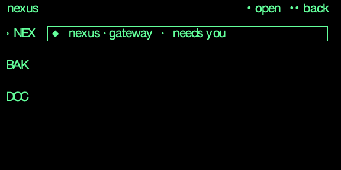
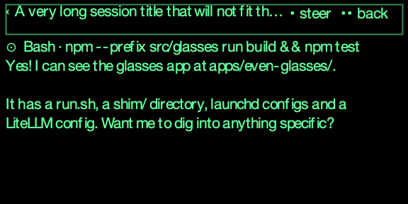
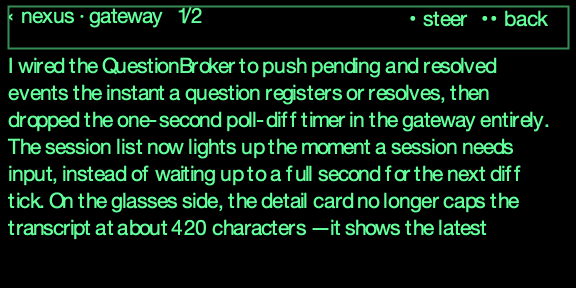
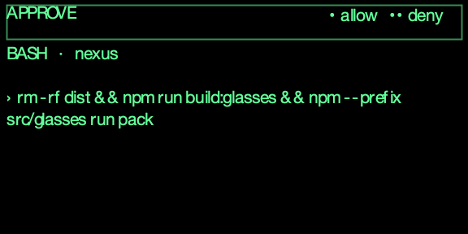
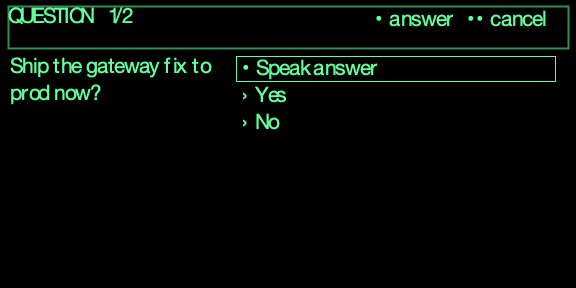
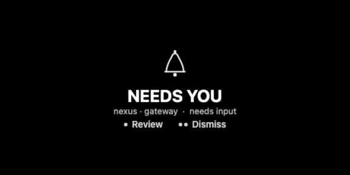

# session-cockpit / glasses

Cockpit client for the [`session-cockpit` hub](../README.md).

- **Phase 3a:** a web dashboard — connect to the hub, watch your sessions,
  arm the cockpit, and allow/deny tool approvals live over SSE. Runs in any
  browser and inside the Even app WebView / `evenhub-simulator`.
- **Phase 3b:** the first Even G2 HUD, rendering via `even-toolkit` (adapted
  from claude-code-g2 — see [NOTICE.md](NOTICE.md)) in text-page mode.
- **Phase 3c (this):** the HUD rebuilt on `even-toolkit`'s `GlassesSdk` element
  renderer — native bordered cards, a status rail, native list selection, active-
  session filtering, and a bitmap "needs you" hero. The dashboard and the HUD
  share one hub feed and one store; `src/glass/` drives the glasses.

## Using the HUD — a new user's guide

Everything on the glasses is driven by **three gestures on the touchpad** (the side
of the frames). You never touch the terminal.

### The three gestures

| Gesture | How | What it does |
| --- | --- | --- |
| **Tap** | one touch | the **primary** action on the screen (open, Allow, Review) |
| **Double-tap** | two quick touches | the **secondary** action (back, Deny, Dismiss, arm) |
| **Slide up / down** | run a finger along the temple | move the highlight / scroll |

Where a screen asks you to choose, it shows the gesture as **dots**, so you can read
the choice without memorising anything:

- **`●`  = one tap**  →  e.g. `● Allow`, `● Review`
- **`●●` = two taps** (double-tap)  →  e.g. `●● Deny`, `●● Dismiss`

One dot, one tap. Two dots, two taps.

### Reading the session list at a glance

Each row is a running Claude Code session. The **dot before the name** is its state:

- **`●`  needs you** — it's blocking on you (a permission prompt, or it asked something)
- **`◐`  live** — a session with a process running right now
- **`○`  idle** — quiet

The list only shows **active** sessions — ones with a live process (or that need you);
finished / archived sessions are hidden, so it stays short and relevant. The small dot
in the top-left **status rail** is your link to the hub: **`●` connected**, **`×` can't
reach the hub**.

### What "armed" means

**Arming** is how you hand permission decisions to the glasses:

- **Standby** *(the safe default)* — the cockpit stays out of the way. Claude Code shows
  its normal Allow/Deny prompts **on your computer**, exactly as usual. Nothing is
  intercepted.
- **Armed** — the cockpit **intercepts** those permission prompts and sends them to your
  **glasses** instead, so you can Allow/Deny from anywhere. Arm it when you step away
  from the desk but still want your sessions to keep moving.

Toggle it with a **double-tap on the session list**; the rail shows `armed` or
`standby`. Nothing ever auto-approves — armed just means *you* get asked on the glasses.

### The screens

You navigate **Projects → Sessions → Transcript**, and three screens can take over from
wherever you are. Every screen names its own gestures in the top-right corner, so the
pictures below double as the reference.

| Screen | You see it when… | Tap `●` | Double-tap `●●` | Slide |
| --- | --- | --- | --- | --- |
| **Projects** (home) | default | **open** the project | **exit** the app | move highlight |
| **Sessions** | you opened a project | **open** the session | **back** to projects | move highlight |
| **Transcript** | you opened a session | **speak a steer** (voice) | **back** to sessions | **scroll** the reply |
| **Steer** | you tapped ● on a transcript | **send** the steer now | **cancel** | — |
| **Approve** | a session needs permission to run a tool | **allow** | **deny** | — |
| **Question** | a session asked you something | **answer** (highlighted option) | **cancel** | move highlight |
| **Needs you** | a session wants your input (nothing to approve) | **Review** (jump to it) | **Dismiss** | — |

**Approve**, **Question** and **Needs you** interrupt whatever you're looking at — they're
what gets *pushed* to you; everything else you pull. Nothing auto-fires: an approval is
shown and waits for a deliberate tap.

#### Projects — home


Sessions grouped by project, newest activity first. Each row is `badge · name · status`,
where the badge is the project's own three-character rail badge — the **same one the
desktop sidebar shows**, so the two read alike. The status answers the only question that
matters at a glance: `◆ needs you`, `⊙ n running`, `○ n idle`.

#### Sessions — inside a project



The badge rail on the left marks where you are (`›`) and lets you slide between projects
without going back. Its width is measured from the widest badge on screen, so three-letter
badges never clip. Rows are `glyph · title · status`.

#### Transcript — a session



The header is `‹ title` plus the gestures, truncated to the pixels the bar actually has
left. Below it: the live activity line (`⊙ Bash · npm --prefix …`) when a tool is running,
then the latest reply with Markdown flattened — no stray `**` or backticks eating a line
of a seven-line screen.



A long reply paginates; the header shows `n/total` and you slide to move through it.

#### Approve — a permission gate



Only reachable with **Supervise** on. Names the tool and project, then the exact command,
wrapped rather than cut, so you are never approving something you can't fully see.

#### Question — the agent asked you something



The question on the left, the options on the right. `QUESTION 1/2` means a multi-question
prompt. `● Speak answer` is the free-text path — tap it and answer out loud instead of
picking one of the offered options.

#### Needs you — the interrupt



The one screen that is a bitmap rather than firmware text, because it has to read as an
alarm from across a room rather than as a list. It pushes over whatever you were looking
at; `● Review` jumps to the session, `●● Dismiss` puts it down until the attention set
changes.

> These images are generated from the live UI — `npm --prefix src/glasses run capture:screens`
> against a dev server re-renders them from `?sim=preview`. Re-run it after a layout change
> so the reference can't quietly go stale.

## Under the hood

`src/glass/AppGlasses3c.tsx` drives the G2 via `even-toolkit`'s `GlassesSdk` element
composition (positioned bordered cards, native list selection). It renders nothing to
the DOM — the glasses are the view. Screens are picked by priority (approval > needs-you
> transcript > list); the "needs you" hero is a bitmap (image containers), the rest are
native text/list cards.

## Run

```bash
cd apps/session-cockpit/glasses
npm install
npm run dev            # http://localhost:5173
```

In another shell, start the hub and arm it:

```bash
cd ../hub && npm start
```

Open http://localhost:5173, enter the hub URL (`http://127.0.0.1:8899`, blank token
in dev), and Connect. Trigger a tool call in any Claude Code session that has the
cockpit hook installed — it appears under **Approvals waiting**; Allow/Deny releases
it.

## In the browser (`?sim=preview`)

The fastest way to look at the HUD — no hardware, no simulator install:

```bash
npm --prefix src/glasses run dev     # then open http://localhost:5273/?sim=preview
```

It draws the **real composed page**: `composeCockpitPage()` builds the same
`GlassesPage` the glasses receive, and the preview paints that page's own element
coordinates and content. It cannot drift from the shipping UI the way a hand-drawn
mockup would — change the layout in `AppGlasses3c.tsx` and the preview changes with it.

- Pickers for fixture (`list`, `detail-*`, `approval`, `question*`), screen, and project
  index, so every screen is reachable — including `approval`, which has no live path
  without Supervise on.
- A per-element readout (`type`, `x,y`, `w×h`, content) underneath — useful when a
  label is being truncated and you want to know by how much.
- Text is measured with `@evenrealities/pretext`, the same LVGL metrics the firmware
  uses, and each glyph is placed at its true advance — so **line breaks and overflow
  are accurate**, which is the thing worth previewing.
- The `interrupt` screen renders its actual bitmap hero; `?sim=lab-*` mockups now draw
  in the browser as well as pushing to the lens.

Exact: geometry, text, line breaks, advances. Approximate: glyph shapes (the lens font
isn't available to a browser) and the firmware's internal container padding. **For
pixel truth, use the simulator below** — it runs the real LVGL renderer.

## On the simulator

The [`evenhub-simulator`](https://www.npmjs.com/package/@evenrealities/evenhub-simulator)
renders the actual 576×288 LVGL glass canvas, so you can see and drive the HUD
without hardware:

```bash
npm install -g @evenrealities/evenhub-simulator     # once

# point it straight at the hub via the ?hub= auto-connect (skips the Connect form):
evenhub-simulator "http://localhost:5173/?hub=http://127.0.0.1:8899"
```

`?hub=<url>&token=<t>` (handled in `main.tsx`) seeds the hub credentials only if
none are stored — handy for the simulator and the real Even app, which load a URL
but can't fill the form. Same machine, so `localhost` works for the dev server and
the hub alike.

### Scripted / headless (automation API)

Launch with `--automation-port` to get an HTTP control surface — used to verify
this HUD end-to-end:

```bash
evenhub-simulator --automation-port 9898 "http://localhost:5173/?hub=http://127.0.0.1:8899"

curl 127.0.0.1:9898/api/ping                                   # -> pong
curl 127.0.0.1:9898/api/screenshot/glasses -o hud.png          # real framebuffer PNG
curl 127.0.0.1:9898/api/console                                # webview logs/errors
curl -XPOST 127.0.0.1:9898/api/input \
  -H 'content-type: application/json' -d '{"action":"click"}'   # a gesture
```

**`/api/input` requires `Content-Type: application/json`** — without it the sim
silently rejects the request (no gesture, no error). Gesture map: `click` = tap
(Allow / open / Review), `double_click` = 2-tap (Deny / back / dismiss / arm-toggle),
`up` / `down` = slide the selection. Input only registers while an event-capture
container (list or text) is active — every screen marks one.

## Load on the glasses

Both routes use the Even CLI: `npm install -g @evenrealities/evenhub-cli`
(`evenhub`). All four screens plus the voice flow are verified on real G2 hardware;
the simulator re-implements the draw path, so expect small differences (list-scroll
focus, font metrics, missing-glyph handling, and gesture timing — a single hardware
tap can double-fire, which the renderer debounces).

### Dev mode (QR) — the normal way to test, no publishing

The Even app on your phone loads your dev server over the LAN and mirrors it to the
glasses. The phone must reach **both** the dev server and the hub, so `localhost`
won't do — use the Mac's LAN IP. **Run all of these from `apps/session-cockpit/glasses/`:**

```bash
# 1. hub on all interfaces (it defaults to 127.0.0.1 only). ../hub = the hub dir
#    relative to glasses/ — from apps/session-cockpit/ it's just `hub`.
HUB_HOST=0.0.0.0 npm --prefix ../hub start           # :8899

# 2. dev server (vite --host already exposes it on the LAN)
npm run dev                                           # :5173

# 3. one command: detect LAN IP, preflight both servers, print the QR
npm run qr
```

`npm run qr` ([`scripts/qr.sh`](scripts/qr.sh)) auto-detects this Mac's LAN IP,
builds the app URL with the `?hub=` auto-connect param, checks that the dev server
and hub are actually reachable on that IP (and reminds you to bind the hub to
`0.0.0.0` if not), then renders the QR. Scan it in the Even app's developer /
dev-load screen → the glasses load the HUD and auto-connect to the hub.

Overrides: `DEV_PORT`, `HUB_PORT`, `HUB_TOKEN` (appended as `&token=`), `LAN_IP`
(force it). Or drive `evenhub qr --url …` directly.

**Over Tailscale** (phone + Mac on the same tailnet — works off Wi-Fi, stable
address): just add `TS=1`:

```bash
HUB_HOST=0.0.0.0 npm --prefix ../hub start    # still bind all interfaces
npm run dev
TS=1 npm run qr                               # uses this Mac's Tailscale IP
```

`HUB_HOST=0.0.0.0` already covers the Tailscale interface, and the WireGuard tunnel
is encrypted, so plain HTTP is fine — no HTTPS or public exposure. A tailnet is only
as private as its device list, so set `HUB_TOKEN` if others share it. (ngrok/a public
tunnel works too — set `HUB_TOKEN` and pass `LAN_IP=<that-host>`.)

**Voice key (for speaking answers/steers on the glasses).** The mic → text path
(even-toolkit STT, **Deepgram** by default) needs a provider key, or the voice
affordance stays hidden. Put it in `.env.local` (build-time, gitignored — never commit
it) so it isn't in the QR:

```bash
cp .env.example .env.local          # then set VITE_STT_PROVIDER=deepgram + VITE_STT_API_KEY=<key>
npm run dev                          # restart so Vite picks up .env.local
```

Or pass it on the dev-load URL: append `&stt=deepgram&sttKey=<key>` (persists to
`localStorage`). Mic use also needs the `g2-microphone` permission in `app.json`,
which must be **served at the site root** — `public/app.json` symlinks to it so Vite
emits it at `/app.json` for the dev-loader to read.

### Packaged build (`.ehpk`) — for a real install / submit

```bash
npm run pack                 # = vite build + evenhub pack app.json ./dist
evenhub login                # Even Realities account, then submit the .ehpk
```

`app.json` is the EvenHub manifest (schema is validated by `pack`): `package_id`,
`edition`, `entrypoint`, and a `network` permission for the hub. The submit/review
step happens on Even's side once logged in.

### Verified on device (and a couple of open items)

Confirmed on a real G2 via dev-load: all four screens render, gestures route
(tap / double-tap / scroll — with the double-fire debounce), the mic opens and streams
to Deepgram, and the full voice loop works (speak → tap send → hub → injected). The
dev-loader **does** read `<url>/app.json` for permissions, so `g2-microphone` must be
in a **served** `app.json` (`public/app.json` symlinks to it). Note: the Even app
caches the loaded app hard — to force fresh JS, bump a cache-bust query param **and**
remove + re-add the dev app.

Still open:

- **`network` whitelist.** For a packaged build, restrict `permissions[].whitelist`
  to your hub origin; confirm whether dev mode enforces it at all.
- **Packaged (`.ehpk`) install/submit** through Even's review — only the dev-load path
  is exercised so far.

## Stack

React 19 + Vite, no framework beyond that for the dashboard. `src/api.ts` +
`src/types.ts` mirror the hub contract; `src/store.ts` is a tiny
`useSyncExternalStore` shared by both views. The HUD (`AppGlasses3c`) drives the
glasses through `even-toolkit`'s `GlassesSdk` element renderer over
`@evenrealities/even_hub_sdk`; the bitmap "needs you" hero encodes 16-grey PNG tiles
via `upng-js`. Voice (answering questions and steering) runs even-toolkit's `STTEngine`
+ `GlassBridgeSource` over the glasses mic; backend is config-driven (`VITE_STT_*`),
Deepgram by default. See `src/glass/stt.ts`.
